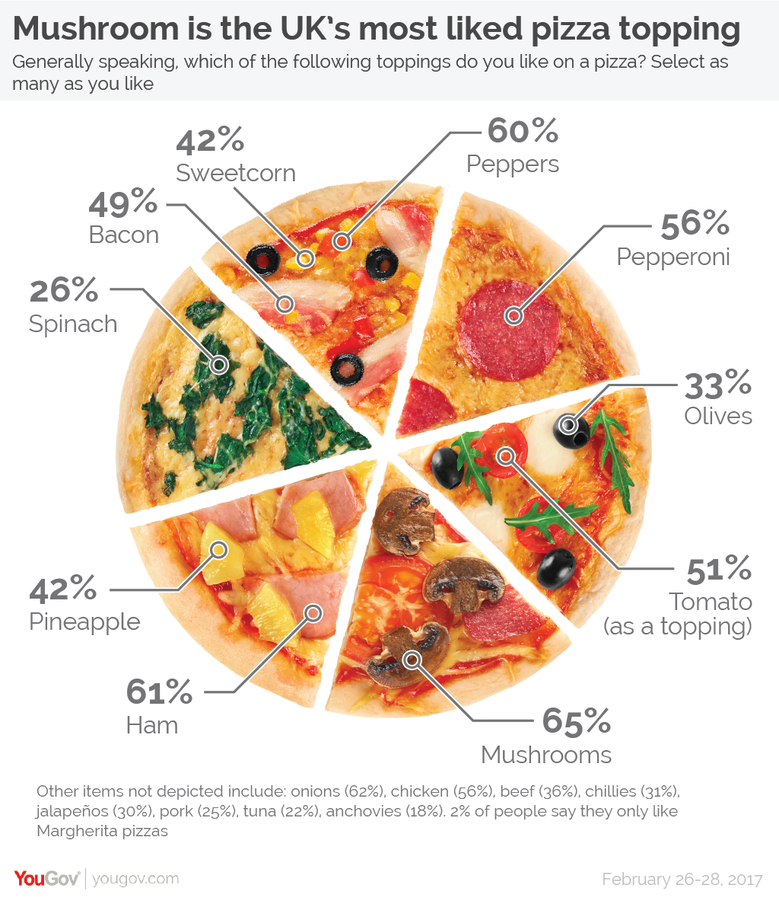

#GraphFix
Original visualization can be found at:
https://data.world/makeovermonday/2020w13-does-pineapple-belong-on-a-pizza

##This project I call "GraphFix" is my improvement of an existing data visualization regarding the most popular pizza toppings in the U.K.
The original title was "Does pineapple belong on a pizza?"

##In examining the dataset, however, the title is misleading and includes much more information than just Britons' preference for pineapple on pizza.
A better title and graphic for this data set would be as follows:
# What is the most popular pizza topping in the U.K.?

