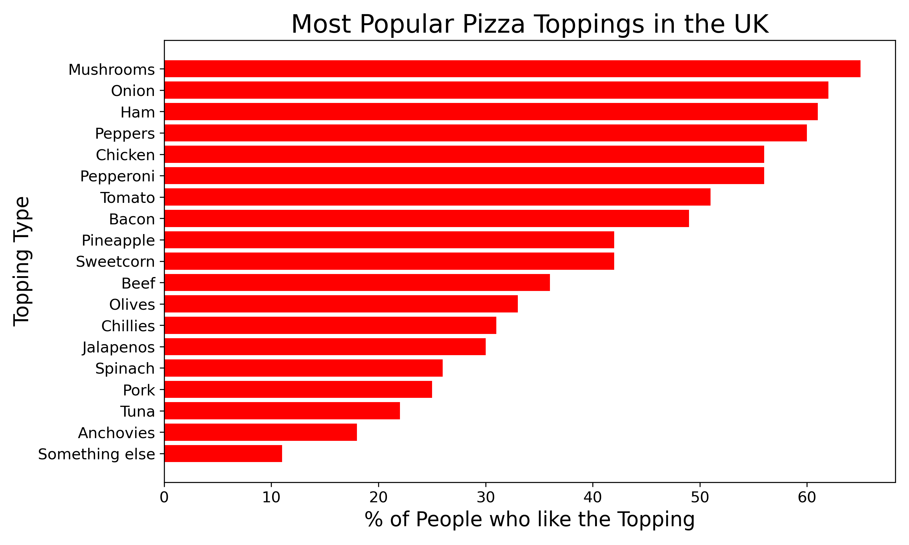

# GraphFix
Original visualization can be found at:
https://data.world/makeovermonday/2020w13-does-pineapple-belong-on-a-pizza

## This project I call "GraphFix" is my improvement of an existing data visualization regarding the most popular pizza toppings in the U.K.
The original title was "Does pineapple belong on a pizza?" In examining the dataset, however, the title is a bit misleading. While a portion of the article references Britons' preference for pineapple, a second pie chart is also included which lists out pizza toppings with a percentage of people in the UK who like that topping on their pizza.  The graphic provided on the referenced site is very confusing in a pie chart form and chaotic in its nature.
Below is the original visualization (yuck!):

Pie charts really should only be used when illustrating 2 comparative items, say 2 contrasting percentages in a poll (Yes or No) that add up to 100%. Maybe you could add a third option if it is a really small amount, but pie charts can be incredibly difficult to read and digest the more complicated they become.

# A bar chart would best illustrate the data included within the given data set.
A better title and graphic for this data set would be as follows:

# What is the most popular pizza topping in the U.K.?

